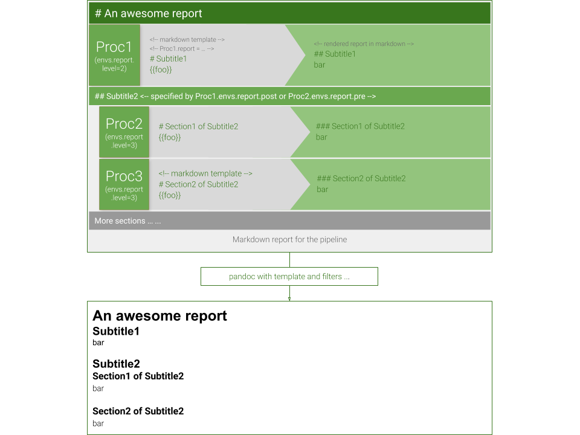

Following figure demonstrates how the plugin works:

Each process that you want to report, will need to have a template assigned with `pXXX.report`. Like scripts, you may prefice it with `file:`, and then followed by an absolute path to the template or a relative one to where it's assigned. You may even assign a template using a direct string. A process with no template assign will be hidden from the report.

You can use the data from the jobs or the process to render the template.

By default, you have one heading with level 1 (`h1`), which is the title of your report. Each process report will be at level 2 headings unless you specify a different level.

The report for each process will then be assembled by the plugin, and converted using pandoc with a default template and some built-in filters. Finally, your report will be a standalone html file.